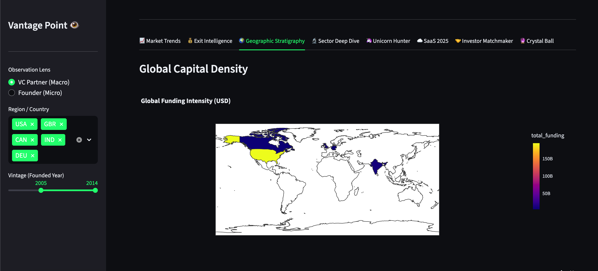

# Vantage Point: Investment Intelligence Dashboard

## 🚀 Live Demo

**[👉 Try the Live App Here](https://venturecapital-ujqvnjxgynh5y9ckpesqzi.streamlit.app/)**

Deployed on Streamlit Cloud | Status: ✅ Live

---

## 📸 Screenshots

### 💰 Exit Intelligence


### 🌍 Geographic Stratigraphy


### 🔬 Sector Deep Dive


### 🔮 Crystal Ball - Startup Success Predictor


### 🦄 Unicorn Hunter


---

## Project Overview

**Vantage Point** is a Streamlit-based investment intelligence dashboard designed to identify high-potential sectors and geographies using historical VC data. It focuses on "Investment Thesis" generation rather than simple data exploration.

## Key Features

- **💰 Exit Intelligence** - Capital efficiency analysis and time-to-liquidity metrics
- **🌍 Geographic Stratigraphy** - Global capital density visualization and emerging hubs
- **🔬 Sector Deep Dive** - Interactive sector analysis with funding and exit metrics
- **🦄 Unicorn Hunter** - Top investors and speed-to-valuation analysis
- **☁️ SaaS Benchmarks** - 2025 valuation multiples and Rule of 40 metrics
- **🤝 Investor Matchmaker** - Searchable database of investors by sector
- **🔮 Crystal Ball** - ML-powered startup success predictor (Random Forest model)

## Quick Start

### Local Deployment

```bash
pip install -r requirements.txt
streamlit run app.py
```

### Cloud Deployment

Already deployed! Visit: **[Live App](https://venturecapital-ujqvnjxgynh5y9ckpesqzi.streamlit.app/)**

To deploy your own:
1. Push to GitHub
2. Go to [Streamlit Cloud](https://streamlit.io/cloud)
3. Connect repository and deploy

## Files

- `app.py` - Main dashboard logic and UI
- `utils.py` - Data cleaning and financial metrics
- `requirements.txt` - Python dependencies
- `.streamlit/config.toml` - Streamlit configuration
